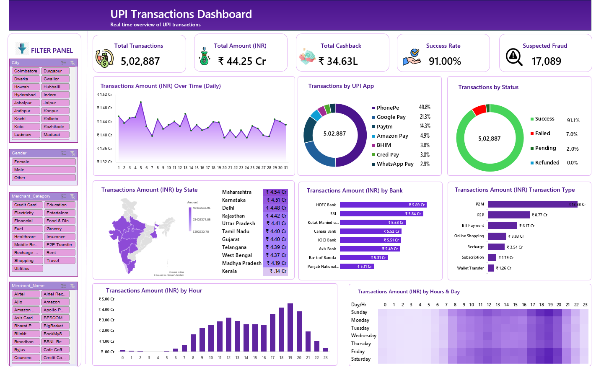

# UPI Transactions Dashboard

## 📊 Dashboard Preview

## 📌 Project Overview
An interactive and dynamic UPI Transactions Dashboard built entirely using Microsoft Excel. This project processes real-time transaction data to analyze user habits, bank performances, regional trends, and operational metrics.

### 🎯 Key Visuals & Insights Included:
* **KPI Summary Cards:** Real-time visibility into Total Transactions, Amounts (INR), Cashbacks, Network Success Rates, and Suspected Fraud metrics.
* **Geographical Insights:** Mapping transaction density directly across distinct Indian States.
* **Time-Block Trends:** A detailed hour-by-day heatmap illustrating peak transaction volume intervals throughout the week.
* **Platform & Channel Breakdowns:** Distribution metrics sorted across UPI Mobile Applications and Transaction Types (P2M vs P2P).

### 🛠️ Technical Stack Used:
* **Data Engineering:** Power Query for data parsing and schema transformations.
* **Analytical Modeling:** Pivot Tables, customized conditional formatting matrix grids, and interactive cross-visual Slicer configurations.
* **UI Design:** Customized monochromatic Lavender theme execution for professional report delivery.
*
